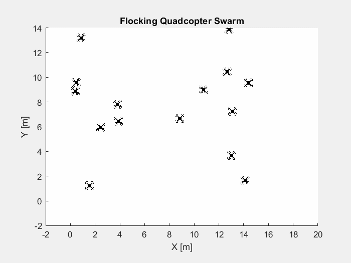

🚁 Flocking Algorithm

💡Have you ever wondered how flocks of birds or drone swarms move so beautifully in sync — without crashing into each other?

In 1986, Craig Reynolds introduced the *Boids* model — a simple yet powerful algorithm that simulates natural flocking behavior.  

Each individual in the swarm follows 3 simple rules:  
 ✅ Separation — steer to avoid collisions  
 ✅ Cohesion — stay close to neighbors  
 ✅ Alignment — match group direction  

That’s it!  
With no leader, no central coordination — complex, lifelike swarm behavior emerges.  

🚁 I simulated this flocking algorithm for a group of quadcopters in MATLAB. The result? A beautiful, natural swarm that dynamically adapts and stays cohesive.

👀 Check it out in action:


This is just a starting point! Flocking algorithms power everything from drone light shows to potential search-and-rescue swarms.

🔗 Explore the code and try it yourself.

 📂 Files
- `flocking_simulation.m` — main simulation code
- `flockingStep.m` — computes flocking behavior
- `quad_icon.png` — (optional) quadcopter icon if you want to plot images instead of circles

 ▶️ How to run
-Open MATLAB, then:
```matlab
flocking_simulation
